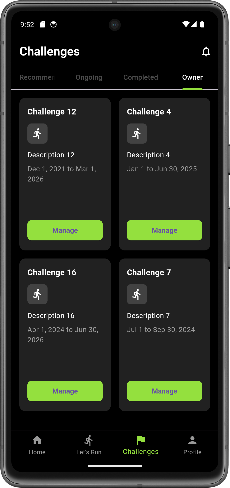

<!--Project logo and contributors-->

  <!-- Logo -->
  
  
  <!-- Title -->
  <h1 style="font-size: 2.5rem; font-weight: bold; color: #333; margin: 0;">RUNMATE</h1>
  
  <!-- Subtitle -->
  
FIT - HCMUS

  
Mobile Development

  

<!-- Contributors -->

  <h2 style="font-size: 1.4rem; color: #333; font-weight: bold; margin-bottom: 10px;">Contributors</h2>
  <ul style="list-style: none; padding: 0; margin: 0;">
    <li style="margin: 8px 0;">
      <a href="https://github.com/ngocdai101004" target="_blank" style="text-decoration: none; color: #007bff; font-size: 1rem; font-weight: 500;">
        Tran Ngoc Dai
      </a>
    </li>
    <li style="margin: 8px 0;">
      <a href="https://github.com/TerryTantan" target="_blank" style="text-decoration: none; color: #007bff; font-size: 1rem; font-weight: 500;">
        Nguyen Thanh Tuan
      </a>
    </li>
    <li style="margin: 8px 0;">
      <a href="https://github.com/tuongkhtn" target="_blank" style="text-decoration: none; color: #007bff; font-size: 1rem; font-weight: 500;">
        Huynh Thanh Tuong
      </a>
    </li>
    <li style="margin: 8px 0;">
      <a href="https://github.com/neihTN" target="_blank" style="text-decoration: none; color: #007bff; font-size: 1rem; font-weight: 500;">
      Nguyen Kieu Duc Vinh Thien
      </a>
    </li>
  </ul>

<!--Table of contents-->

## About the project

Runmate is a mobile application designed to help users track and enhance their running activities. Built with Firebase and Google Maps API, it offers features like real-time run tracking with map integration, detailed activity stats, and streak tracking to motivate consistent running. Users can participate in challenges and events while securely managing their data, including routes and personal profiles. Runmate aims to inspire users to stay active, achieve fitness goals, and compete for better performance.

## Screens

### Register

    

- Users create new accounts by filling in personal information such as name, email, password and confirm password.

### Login

    

- Users log into the system by entering their previously registered email and password.

### Home

    

- Displays an overview of user activity, including running statistics, displaying running-related events.

### Let's Run - Running Tracking Screen

    
    

The **Let's Run** screen provides features to help users track their running activities in an intuitive and efficient way:

- **Map Display**: Integrates Google Maps API to show the user's current location using Geolocator and Marker.
- **Running Activity Tracking**: When tapping "Tap to Start," the app records distance, running time, average speed, and calories burned while displaying the running route on the map.
- **Run Data Storage**: Running session data is stored in Firestore for future reference.
- **Run Streak Display**: Checks consecutive running days and displays the **Run Streak** status to keep users motivated.

This feature helps users easily monitor their running progress and maintain a daily workout habit.

### Challenge

#### Recommended/Ongoing/Completed/ Tab

- **Recommended Tab**: Displays a list of suggested challenges based on user activity and preferences. Users can explore and join new challenges to stay motivated.
- **Ongoing Tab**: Shows the challenges that the user is currently participating in. Each challenge entry includes its name, duration, and progress. Users can track their performance and stay engaged.
- **Completed Tab**: Displays a list of challenges that the user has participated in and have already ended. Each challenge entry provides details such as the challenge name, description, and event duration. Users can tap the **Detail** button to see their total distance covered in that challenge before it ended.

##### Include:

- **Challenge List**: Shows all completed challenges, including the challenge name, a brief description, and the event duration. Users can scroll up and down to browse through the list.
- **Challenge Details**: By tapping the **Detail** button on a challenge, users can access a detailed view of the event, including:
  - Comprehensive challenge information.
  - The total distance the user ran in that challenge up until its completion.

This feature allows users to review their past challenges and track their progress over time.

    
    

#### Owner Tab - Challenge Management

The **Owner** tab allows users to view and manage the challenges they have created.

- **Challenge List**: Displays a list of challenges created by the user.
- **Challenge Management**: By tapping the "Manage" button on a challenge, users are navigated to the corresponding management screen, which includes:
  - Detailed challenge information.
  - The **Top 3** participants with the highest running distance.
  - A list of participants in the challenge.
  - An invitation feature, allowing the challenge owner to invite participants via email.
  

      
      
  

